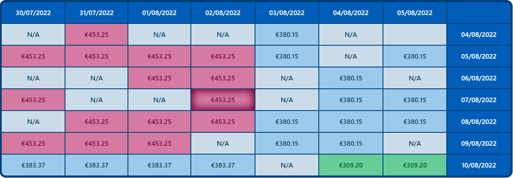

# API Rate Limits

## Introduction
API rate limits are a extremely important concept when designing public APIs. These limits exist to control the amount of incoming and outgoing network traffic to or from the API, which helps preventing server overloads and consequently protects the overall performance. Moreover, this practice protects against certain attacks, for example, DoS attacks that can take the entire system down.

The rate limits must be applied on the server side and managed by the client depending on its use case.

## How to implement on client side

To illustrate a clear use case of managing API rate limits in the client side, lets use a prototype application from Amadeus for Developers. The applications is flight search tool with a calendar feature which shows prices for dates nearby the selected ones. 



The above image shows a screenshot of the app's calendar feature, we can see it shows prices for 3 days before and after the selected dates, both on departure and return dates. To fetch all the prices to this calendar, we have to make 49 request to the ***FlightOffersSearch*** API from the Amadeus Self-Service catalog. In the test environment, this API is limited to 1 request/100ms, so we cannot send all requests at once, otherwise we will get rate limits errors as response.

To manage this limits we have mainly two options, use an external library or build a request queue from scratch. The choice depends on you resources and requisites. There is some great open source ones available for the main programming languages. For this example we are going to use the JavaScript library [`bottleneck`](https://www.npmjs.com/package/bottleneck).

The backend of our application was built using Node.js and the [`Amadeus Node SDK`](https://www.npmjs.com/package/amadeus). Lets take a look at some examples in Node.js.
Below you can find `bottleneck` configuration for test and production environments of Amadeus APIs.

**Test** (10 req/sec and 1 req/100ms)
```ts
const Bottleneck = require('bottleneck');

const limiter = new Bottleneck({
  minTime: 100
})
```
**Production** (40 req/sec)
```ts
const Bottleneck = require('bottleneck');

const limiter = new Bottleneck({
    reservoir: 40,
    reservoirRefreshAmount: 40,
    reservoirRefreshInterval: 1000
  })
```

Description of the options used for the `limiter`.
| Option | Default | Description |
|--------|---------|-------------|
| `minTime`      | `0` ms      | How long to wait after launching a job before launching a new one   |
| `maxConcurrent`   | `null` (unlimited)       | How many jobs can be executed at the same time      |
| `reservoir`   | `null` (unlimited)       | How many jobs can be executed before the limiter stops executing jobs      |
| `reservoir`   | `null` (unlimited)       | How many jobs can be executed before the limiter stops executing jobs. If the `reservoir` reaches `0`, new jobs will be queued up until the reservoir refreshes     |
| `reservoirRefreshInterval`   | `null` (disabled)       | Every `reservoirRefreshInterval` ms the reservoir will be refreshed to the value of `reservoirRefreshAmount`, which should be a multiple of 250      |
| `reservoirRefreshAmount`   | `null` (disabled)       | The value to which the reservoir is going to be set each `reservoirRefreshInterval` ms   |

More details can be found on [`bottleneck`'s GitHub page](https://github.com/SGrondin/bottleneck).

Now that the `limiter` is correctly set, instead of calling the APIs directly in the backend, we use `limiter`'s `schedule` method to queue up requests, and they are going to be executed following the defined rules.

Here's an example on how to call the ***FlightOffersSearch*** API using `bottleneck` and the `Amadeus Node SDK`.


```ts
const Bottleneck = require('bottleneck');

const limiter = new Bottleneck({
    reservoir: 40,
    reservoirRefreshAmount: 40,
    reservoirRefreshInterval: 1000
  })

limiter.schedule(() => {
  amadeus.shopping.flightOffersSearch.get({
    originLocationCode: 'MAD',
    destinationLocationCode: 'LHR',
    departureDate: '2022-12-01',
    returnDate: '2022-12-10',
    adults: 1,
    travelClass: 'ECONOMY'
  });
});
```
Using this strategy you don't have to worry if your client surpasses the API's rate limits, as requests are just going to be queued up and executed accordingly to these limits. To take a look at a full implementation you can refer to the GitHub repository of the above mentioned prototype [here](https://github.com/gustavo-bertoldi/FlightSearchCalendar).

## Start with the example

In the repository you can find a simple example in the file `rate_limits.js`, where the rate limits of Amadeus APIs are managed using `bottleneck` and 50 simultaneously requests are made to the Amadeus APIs. To play around with this example simply run the commands below, aster setting your amadeus credentials in the environments variables `AMADEUS_CLIENT_ID` and `AMADEUS_CLIENT_SECRET`.

```bash
npm install
npm start
```