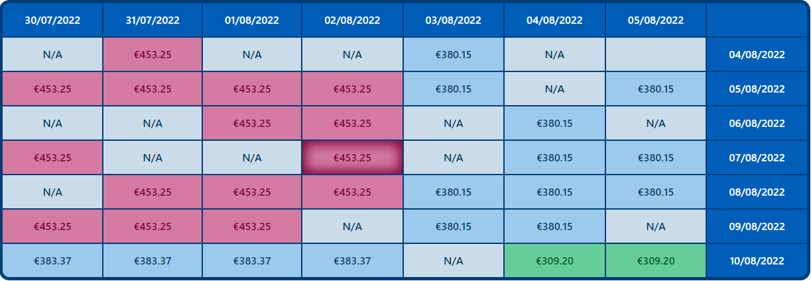

# API Rate Limits

## Introduction
API rate limits are a extremely important concept when designing public APIs. These limits exist to control the amount of incoming and outgoing network traffic to or from the API, which helps preventing server overloads and consequently protects the overall performance. Moreover, this practice protects against certain attacks, for example, DoS attacks that can take the entire system down.

The rate limits must be applied on the server side and managed by the client depending on its use case.

## How to implement on client side

To illustrate a clear use case of managing API rate limits in the client side, lets use a prototype application from Amadeus for Developers. The applications is a flight search tool with a calendar feature which shows prices for dates nearby the selected ones. This app is accessible [here](https://github.com/gustavo-bertoldi/FlightSearchCalendar)

The above image shows a screenshot of the app's calendar feature, we can see it shows prices for 3 days before and after the selected dates, both on departure and return dates. To fetch all the displayed prices, we have to make 49 request to the ***FlightOffersSearch*** API from the Amadeus Self-Service catalog. In the test environment, this API is limited to 1 request/100ms, so we cannot send all requests at once, otherwise we will get rate limits errors as response.

To manage this limits we have mainly two options, use an external library or build a request queue from scratch. The choice depends on you resources and requisites. There is some great open source ones available for the main programming languages. In this repository tou can find example in Node, Python and Java using the respective Amadeus SDK.

